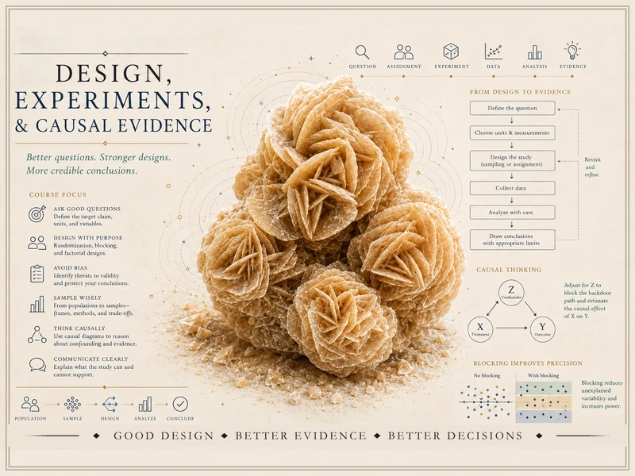

{srcset="assets/hero-web-800.webp 800w, assets/hero-web.webp 1400w" sizes="(min-width: 992px) 760px, 92vw" .course-hero-img fig-alt="Course identity hero for Design, Experiments and Causal Evidence — a tan desert-rose crystal cluster surrounded by study-design graphics including a design-to-evidence workflow, a causal diagram with a confounder and a backdoor path, and a blocking-improves-precision illustration, with the course title."}

# Design, Experiments & Causal Evidence {.course-landing-title}

::: {.course-landing-subtitle}
How statistical evidence is produced — from a question and a design to a defensible claim
:::

> Good statistical analysis does not begin with a p-value, a model, or a software procedure. It begins with a
> **question**, a population or process of interest, a **unit of analysis**, **measurements**, a **design**,
> and assumptions about how the data were generated. This course teaches you to reason about that whole
> chain — to recognize what a study design *can and cannot* support.

## What this course is

This is a course about **how statistical evidence is produced**. It modernizes the traditional design-of-
experiments course by placing experiments inside a broader **evidence framework**: experiments stay central
because random assignment is one of the strongest tools we have for *causal* evidence, but most real
statistical work also involves observational data, imperfect measurement, incomplete sampling frames, missing
data, and practical limits. You learn not only how to analyze a designed study, but how to recognize what any
design can support.

We build the reasoning and the tools in order: statistical questions and units of analysis; measurement and
operational definitions; the signature distinction between **random sampling** and **random assignment**; bias,
confounding, and validity; completely randomized experiments; blocking, paired, and factorial designs;
interactions; observational studies; causal diagrams and backdoor reasoning; surveys and sampling frames;
stratified and cluster sampling; missing data and nonresponse; study critique; and the **design memo** that
states what a study supports and what it does not.

The emphasis throughout is **reasoning, interpretation, and communication**. You will evaluate study designs,
identify threats to validity, explain why randomization matters, distinguish sampling from assignment, analyze
simple experimental and observational data, critique claims, and write design memos that connect statistical
methods to evidence.

We use **R** and **Quarto** to run randomizations, demonstrate blocking, simulate sampling schemes, and adjust
for confounding. But this is a design-and-evidence course, not a programming course and not a regression-
modeling course: **software output does not rescue a weak design**, and every line of code is in service of a
design idea.

## What you will be able to do

By the end of the term, you should be able to:

- Translate a research question into units of analysis, variables, measurements, comparisons, and a target
  claim.
- Distinguish populations, samples, treatment and comparison groups, outcomes, covariates, and experimental
  units.
- Explain the difference between **random sampling** and **random assignment**, and why each supports a
  different kind of conclusion.
- Identify threats to validity — selection and measurement bias, confounding, attrition, nonresponse, missing
  data, and post-treatment adjustment.
- Design and analyze basic experiments, and use blocking, pairing, and factorial designs to sharpen and
  structure comparisons.
- Interpret main effects and interactions in designed studies.
- Evaluate observational studies, distinguish association from causal evidence, and use simple **causal
  diagrams** to reason about confounding, adjustment, and backdoor paths.
- Reason about sampling frames, coverage, and nonresponse, and compare simple random, stratified, cluster, and
  multistage sampling.
- Critique a study claim and write a clear **design memo** — what the study supports, what it does not, and
  what evidence would strengthen it.

## How the site is organized

This public site has three working areas, reachable from the sidebar:

- **Notes** — the weekly instructional spine. Each week poses a design question, develops the concept, works it
  on a recurring campus study, names a common mistake, and offers ungraded self-checks. Start here.
- **Labs** — the hands-on strand. Four short labs in R and Quarto let you build a randomization reference
  distribution, see how blocking sharpens a comparison, simulate confounding and adjustment, and compare
  sampling designs. Code is shown for study; you run it in your own session.
- **Resources** — a design and causal-evidence glossary, a one-page study-design reference that lays the design
  families side by side, and a guide to drawing and reading causal diagrams. Keep these open while you read.

## A recurring campus world

To keep the ideas concrete, the course returns to one synthetic campus world — an effort to improve student
learning and wellbeing — studied three ways: a **randomized experiment** (a study-skills workshop, which earns
*causal* claims), an **observational study** (who chooses to use the tutoring center, where confounding lurks),
and a **survey** (study habits and sleep, where sampling and nonresponse decide what we can claim). All data
are **synthetic, with seeds set**; the same questions seen through three designs make the design choice
visible.

## Software

We use **R** (via RStudio or Posit Cloud) together with **Quarto**. No prior coding experience is assumed — the
work is scaffolded and the code is explained as it goes. On this site, R chunks are **shown as
static teaching code** and are not executed in place; you run them in your own session.

## Source and attribution

These notes are the course's own synthesis, **grounded in but not copied from** open and freely available
sources:

- **Primary materials:** instructor notes, examples, and design guides (the course's own work).
- **Design & sampling concepts:** *Introduction to Modern Statistics*, 2nd ed. (Çetinkaya-Rundel & Hardin) —
  free at [openintro-ims.netlify.app](https://openintro-ims.netlify.app/). **License: CC BY-SA 3.0.**
- **Randomization & sampling labs:** *Statistical Inference via Data Science: A ModernDive into R and the
  Tidyverse*, 2nd ed. (Ismay, Kim & Valdivia) — free at [moderndive.com/v2](https://moderndive.com/v2/).
  **License: CC BY-NC-SA 4.0.**
- **Optional advanced causal reference:** *Causal Inference: What If* (Hernán & Robins) — freely readable
  online; named and linked only.

All example data are **synthetic with seeds set**; the prose here is original.

## A note on what is public here

Everything on this site is **public and ungraded** — study material only. You will not find graded prompts,
answer keys, rubrics, point values, or schedules here. The operational side of the course — graded design
checkpoints, quizzes, design memos and homework, applied design labs, the midterm, the final design project,
and the final exam, along with all dates and submissions — lives in **Blackboard (the LMS)**, which is
authoritative. If this site and Blackboard ever disagree, follow Blackboard.

::: {.callout-note}
## Draft course site

This site is a **draft course site**, not a finished release. Some pages are drafts, every
numeric value in the example studies is **synthetic and provisional pending human review**, and no
accessibility-compliance claim is made. Treat it as a work in progress rather than the final word.
:::
